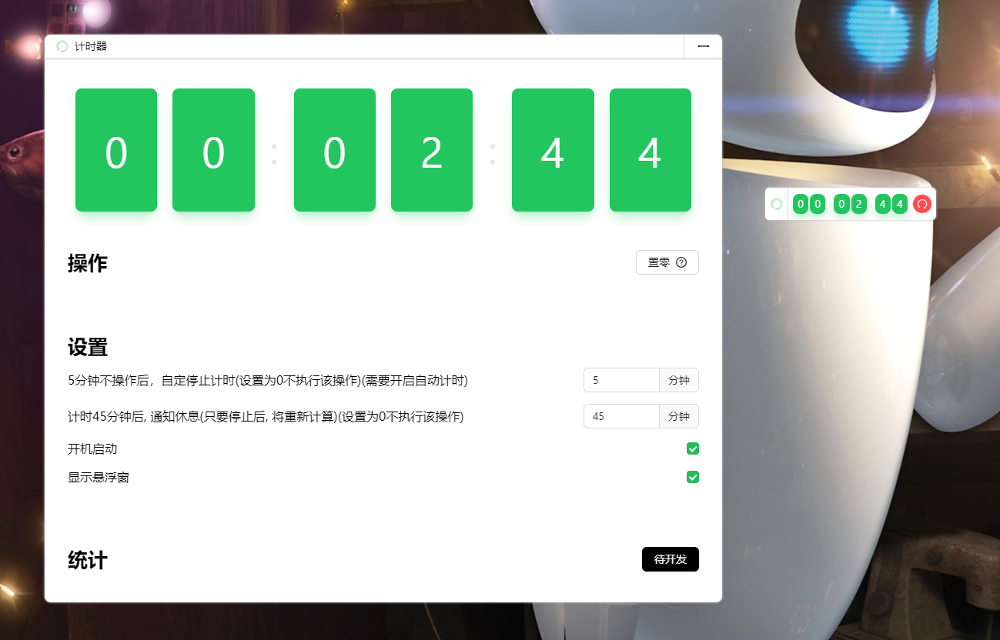

# electron-timer

### electron文档

- [electron-vite 构建工具](https://cn.electron-vite.org/)
- [electron 官方文档](https://www.electronjs.org/zh/docs/latest/tutorial/dark-mode)
- [electron-builder 打包](https://www.electron.build/configuration)
- [electron-store 本地存储](https://www.npmjs.com/package/electron-store)
- [进程通信`ipcMain`(主应用使用)和`ipcRenderer`(浏览器使用)](https://www.electronjs.org/zh/docs/latest/tutorial/ipc)
- [预加载脚本(src\preload\index.ts)](https://www.electronjs.org/zh/docs/latest/tutorial/tutorial-preload)
    - BrowserWindow 的预加载脚本运行在具有 HTML DOM 和 Node.js、Electron API 的有限子集访问权限的环境中。

### python

- 注意版本兼容问题
- [python 监听键盘鼠标事件(文件: python\keyboard_mouse.py)](https://pypi.org/project/pynput/)
- [pyinstaller 打包成exe](https://pypi.org/project/pyinstaller/)

### node

- [参考node-global-key-listener 引入python文件](https://github.com/LaunchMenu/node-global-key-listener/blob/949d7c200fdb08b09d588a9d26720bb73ee7077c/src/ts/WinKeyServer.ts#L9)

### 应用

- 启动后，默认最小化在系统托盘上
- [logo 图地址( #27b95a)](https://icon-sets.iconify.design/?query=meditation-timer)
- 界面 

### 开发需求

- 显示
    - 格式: 00:00:00
    - 显示数值: 0 - 9
- 操作
    - ~~开始 重置 停止~~ 删掉
    - 置零 增加新操作，时间累计，显示从零开始

- 设置
    - x分钟不操作后，自定停止计时
    - 计时x分钟后，通知休息
    - ~~开机自动计时~~ 直接启动就计时
    - 显示悬浮窗
    - 开机启动

- 统计
    - 记录每天情况(未开发)
